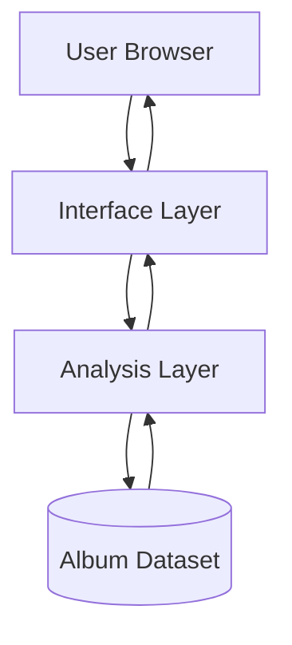

The documentation is written for two groups of readers:

- **[End-users](#conceptual-overview-for-users)**
  Users who interact with the app in their browser to explore their album ranking collection. They want to understand what kinds of metrics the app can provide and how to interpret the information presented.

- **[Developers](#conceptual-overview-for-developers)**
  Readers familiar with R who may inspect, adapt, or extend the application. They want to understand how the various parts of the software fit together before modifying the code.

This overview explains what the software represents, what it provides and does not provide, what data it uses, and how the system is organized.
# Conceptual Overview (for Users)
## Software Overview

*My Favorite Albums* is an analytics dashboard that presents a curated dataset of ranked albums provided by the user. It is designed for exploration and analysis, with tools to view patterns in artists, rankings, yearly trends, and vinyl ownership.

The application allows a user to inspect yearly rankings, examine an artist’s average rating, compare artists across time, and identify highly rated albums not owned on vinyl. All outputs are interpretations of stored rankings. The program does not generate new data, and user interaction never modifies the dataset.

Overall, the software should be understood as a **lens over a dataset**, not a system that maintains or updates the dataset. Each tab represents a different way of looking at the same information rather than a different collection of information.

## UI and General Navigation

The interface presents a single page containing multiple views for different ways to process the data. Each view (tab) corresponds to a different type of question a user may have about the collection.

The tabs are not sequential steps. Instead, the user selects the tab based on the perspective they want:

- Inspect overall collection statistics
- Filter albums by year
- Examine a specific artist
- Identify highly rated artists
- Compare two artists over time
- Discover unowned vinyl records

Each tab does not change the stored data; it only changes the **interpretation** of the same dataset. The same album may appear in multiple tabs because each tab recalculates results from the shared source.

## Data Storage

The application depends on a dataset stored as a CSV file named `album-rankings.csv`. Each row represents a single album record, with the following fields:

`Year, Ranking, Album, Artist, Rating, Vinyl, EP, Live`

To understand the behavior of the program, three terms are important:

- **Record**: A row describing a ranked album
- **Dataset**: The full collection of album records in the CSV file
- **View**: An interpretation of the dataset (not a separate stored table)

All results shown by the application are **views** of the same dataset. The software never creates new or separate collections; these are computed each time they are requested from the dataset.

# Conceptual Overview (for Developers)
## Software Overview (for Developers)

The application is a single interactive analysis program built with R and Shiny. Conceptually, it contains three parts:

- **Interface layer**: gathers page state and displays results
- **Analysis layer**: performs filtering, grouping, and comparison operations on the dataset
- **Data layer**: holds the album information stored in `album-rankings.csv`

Feature modules (tabs) correspond to questions about the dataset rather than independent services. Each module applies a transformation to the same shared data and returns a representation suitable for display.

The system has no persistent runtime state. The dataset exists outside the application, inside the repository, and is read once when the program starts.

> **Note:** Updates to `album-rankings.csv` will not take effect while the program is running.

## Architecture Diagram

The user interacts with the browser interface. The interface sends requests to the analysis layer, which performs transformations on the dataset and returns results to be displayed.

## Data Flow

### System-Level Flow

The application follows a repeated interpretation cycle:

1. The dataset is loaded into memory when the program starts.
2. A user selects a tab and optionally chooses parameters.
3. The interface sends the request to the analysis layer.
4. The analysis layer filters, groups, or aggregates the dataset.
5. A table or chart is generated and displayed.

**Dataset → Transformation → Displayed Result**

As mentioned previously, the dataset itself is never modified during this process.

### Feature-Level Transformations

Each tab performs a specific type of transformation on the same dataset, on a high leve they are:

- **Summary view**: counts records and identifies most frequent artists
- **Year filtering**: selects records within a time range
- **Artist inspection**: groups records by artist and computes averages
- **Artist ranking**: aggregates artists and filters by thresholds
- **Comparison**: aligns two artists’ records across time and visualizes them
- **Vinyl discovery**: filters records based on rating and ownership flags

## Conceptual Behavior

Because all features operate on a shared dataset:

* No view stores independent data
* All results are consistent across tabs
* The application behaves deterministically
* Restarting the program resets the interface but not the data

The system should therefore be understood as a query-and-visualization tool rather than a database editor. It answers questions about a curated album collection but does not manage the collection itself.
